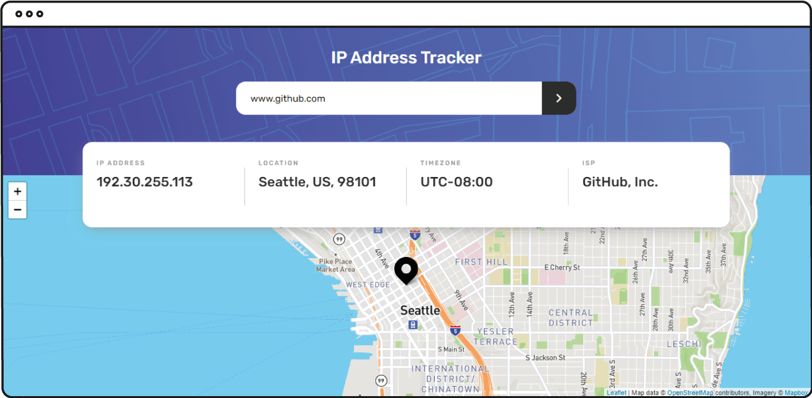
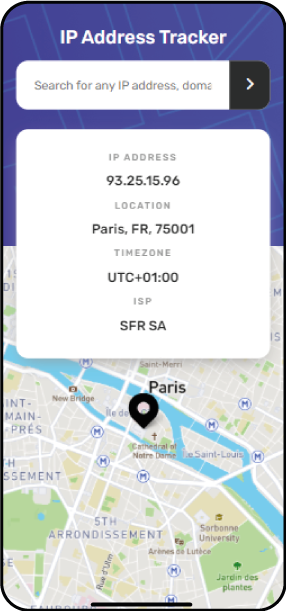

# Frontend Mentor - IP address tracker solution

This is a solution to the [IP address tracker challenge on Frontend Mentor](https://www.frontendmentor.io/challenges/ip-address-tracker-I8-0yYAH0).

## Table of contents

- [Overview](#overview)
    - [The challenge](#the-challenge)
    - [Screenshot](#screenshot)
    - [Links](#links)
- [My process](#my-process)
    - [Built with](#built-with)
    - [Useful resources](#useful-resources)
- [Author](#author)

## Overview

### The challenge

Users should be able to:

- View the optimal layout for each page depending on their device's screen size
- See hover states for all interactive elements on the page
- See their own IP address on the map on the initial page load
- Search for any IP addresses or domains and see the key information and location

### Screenshot




### Links

- Live Site URL: [View online](https://simonemandola.github.io/ip-address-tracker/public)

## My process

### Built with

- Semantic HTML5 markup
- CSS custom properties
- Flexbox
- CSS Grid
- Mobile-first workflow
- Vanilla JavaScript
- Gulp
- npm

## 1. Install npm

Install packaje-lock.json

```bash
npm init
```

## 2. Gulp

### 2.1. Install Gulp

The Installation will be global (⚠ *If it hasn't been installed yet*)

```bash
npm install --global gulp-cli
```

In the project folder, run the command (*If it has already been installed globally*)

```bash
npm install gulp
```

### 2.2. Install dependencies

Copy and paste all dependecies

```bash
npm i browser-sync gulp-exec gulp-sourcemaps gulp-babel gulp-uglify gulp-rename gulp-concat gulp-dart-sass gulp-htmlmin gulp-iconfont
```

If you are not using framework you need 'babel/core'

```bash
npm install @babel/core --save
```

also you need 'babel/preset-env'

```bash
npm i @babel/preset-env
```

On Windows

Line 41~ "gulpfile.js"

```jsx
.pipe(exec('rmdir dist'))
```

### 2.3. Create gulpfile.js

In the root directory create gulpfile.js

### 2.4. Run Gulp

In project folder, run the command (*develop mode*)

```bash
gulp dev
```

## 3. Add assets directory

Create '**src**' dir in the root of project and add '**assets**' dir

[assets.rar](https://s3-us-west-2.amazonaws.com/secure.notion-static.com/851db94e-4854-47ea-87d1-5270b56c5146/assets.rar)

## 4. Add index.html

If you don't use any framework, in **root** dir add **index.html**

### Basic <head />

## 5. Add main.js

In **src** directory add **main.js**, then import all .js files

## 6. Add .gitignore

In '**root**' dir add .gitignore

### Useful resources

- [Leafletjs](https://leafletjs.com/) - Leaflet is the leading open-source JavaScript library for mobile-friendly interactive maps.
  forward.
- [Mapbox](https://www.mapbox.com/) - OpenStreetMap.
- [IP Geolocation API](https://geo.ipify.org/) - IP Geolocation API allows you to locate and identify website visitors by IP address. IP location helps prevent fraud, customize web experiences, and maintain regulatory compliance.

## Author

- Website - [Simone Mandola](https://www.simonemandola.com)
- Frontend Mentor - [@simonemandola](https://www.frontendmentor.io/profile/simonemandola)